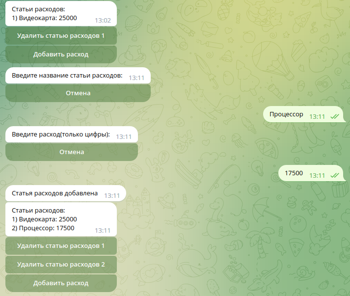

# ViditaSystemsTestTask

## Тестовое задание ViditaSystems

### Установка и настройка

1. Склонируйте репозиторий при помощи команды `git clone https://github.com/meetinger/ViditaSystemsTestTask`
   и перейдите в директорию репозитория
2. Создайте нового бота в https://t.me/BotFather
3. Отредактируйте файлы .env_template и .env_docker_template и переименуйте их в .env и .env_docker соответственно
    1. `BOT_TOKEN`=ваш_токен_из_BotFather
    2. `WEBHOOK_PORT`=порт_для_вебхуков
    3. `WEBHOOK_URL`=url_для_вебхуков
    4. `UPDATE_METHOD`=метод_обновления(webhook или pooling), в случае pooling 4-ый пункт можно пропустить
4. Создайте ключ шифрования и SSL сертификат с помощью команды: 
   `openssl req -newkey rsa:2048 -sha256 -nodes -keyout private.key -x509 -days 3650 -out cert.pem` 
   На шаге `Common Name (e.g. server FQDN or YOUR name) []` 
   введите IP-адрес или домен сервера, на который будут приходить вебхуки
5. Соберите образ контейнера с помощью команды `sudo docker build .`
6. Запустите контейнеры с помощью команды `sudo docker-compose up -d`
7. Проверяем работу бота

### Использование бота

1. `/start` для регистрации в боте
2. `/set_category <имя категории>` создаёт категорию
3. `/categories` показать существующие категории
    1. Вы можете удалить категорию, нажав на соответствующую кнопку
4. После нажатия на кнопку категории, появится календарь для выбора даты 
    
5. После выбора даты появится список текущих статей расходов 
    
    1. Вы можете удалить статью расходов, нажав на соответствующую кнопку
    2. Вы можете добавить статью расходов, нажав на соответствующую кнопку 
        
6. `/cancel` завершить выполнение текущей команды
7. `/total` показать расходы за всё время
8. `/set_utc_offset <время в минутах относительно UTC>` установить часовой пояс
9. `/enable_notifications` и `/disable_notifications` включить и отключить уведомления соответственно:
    1. ВНИМАНИЕ!!! Если не установить часовой пояс командой `/set_utc_offset <время в минутах относительно UTC>`,
       то уведомления работать не будут!
10. В случае, если уведомления включены, то пользователь в конце дня получит уведомление со всеми расходами за сегодня 
    (В реальности пользователь получит уведомление в 23:59, на картинке демонстрация как это выглядит) 
     

### Дополнительные фичи:

1. Возможность отключения уведомлений
2. Учёт часового пояса пользователя
3. Удобный выбор даты в виде календаря

### Тестирование кода

Пока не сделано(
